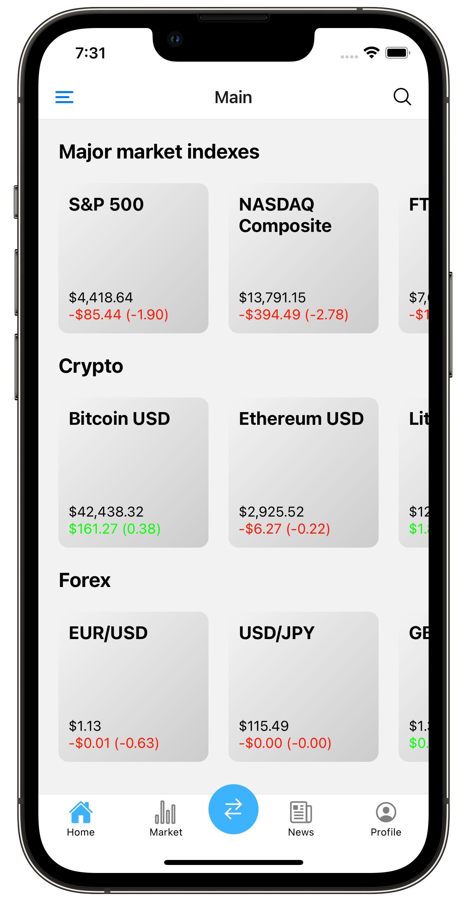

A stock monitoring app, created by Anh Chau

This app provides the most basic needs of a stock trading/monitoring app UI: current market fluctuations, stock lookup, technical analysis and portfolio management.

Login Screen

Overview Screen

Technical analysis Screen

Market news screen, consist of news from various sectors: general, crypto, forex, merger

Portfolio management screen

Also support dark theme

Created with React Native.